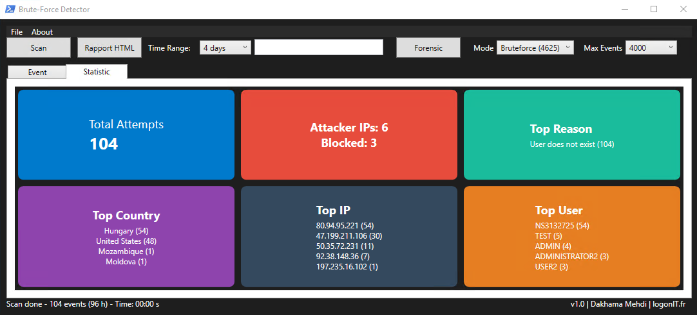
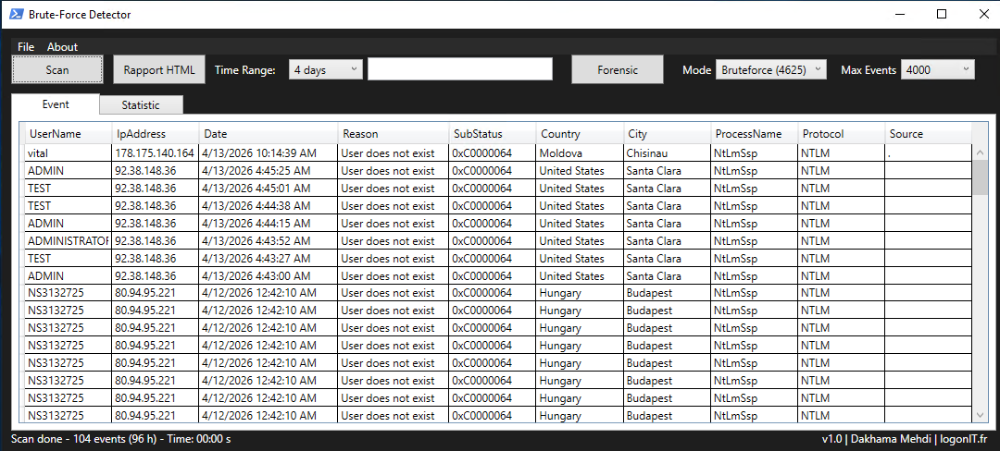

# BruteForce-Detector

BruteForce-Detector is a forensic PowerShell tool designed to detect brute force attacks and analyze authentication activity from Windows Event Logs, providing high-performance analysis through optimized C# and .NET processing.  
Combine it with BruteForce-Blocker to actively block malicious IP addresses and monitor blocked entries directly from firewall rules.  

<p align="Left">
  
</p>

## Overview

This tool provides a simple and efficient way to:
- Read Windows Security logs
- Detect failed and successful logons
- Perform forensic analysis on authentication events
- Generate a complete HTML report

## Examples

[View Online Brute-Force Example ](https://dakhama-mehdi.github.io/BruteForce-Detector/Examples/attack_map.html) 

[View Online Forensic Example](https://dakhama-mehdi.github.io/BruteForce-Detector/Examples/Forensic_Mode.html)

## Install
The tool is designed to be easy to use:
- Launch the `.ps1`
- The script automatically ensures required permissions (Event Log Readers group)
- Analyze logs through a graphical interface
- Generate a ready-to-use forensic report

## Usage

```powershell
.\BruteForce-Detector.ps1
```
## Features

- Graphical interface (GUI)
- One-click execution
- Read-only and safe by design
- Automatic access configuration (Event Log Readers)

### Log Analysis
- Failed logons (Event ID 4625 - Logon Type 3: Network)
- Successful logons (Event ID 4624 – Logon Type 3: Network, Type 10: RemoteInteractive (RDP))
- Correlation between failures and successes

### Detection Capabilities
- Brute force attacks
- Password spraying
- Suspicious IP addresses
- Abnormal authentication patterns

### Forensic Analysis
- Failure reasons (SubStatus)
- Targeted accounts
- IP origin (Country / City)
- Success vs failure correlation

### Security Checks
- Default server configuration review
- Detection of suspicious services
- Identification of anonymous connections

## Output

The tool generates a complete HTML report including:
- KPI summary
- Top attacker IPs
- Targeted users
- Failure reasons
- Success vs failure correlation
- Forensic insights

## Pictures

<p align="Left">
  
</p>

<p align="center">
  
</p>

## Copyright & Contributions

This project is maintained by the LogonIT.fr team.
Thanks to Amrani Soufiane for his contribution.

Contributions are welcome!  
Feel free to open an issue, suggest improvements, or submit a pull request.

By contributing, you help improve the tool and support the community.

